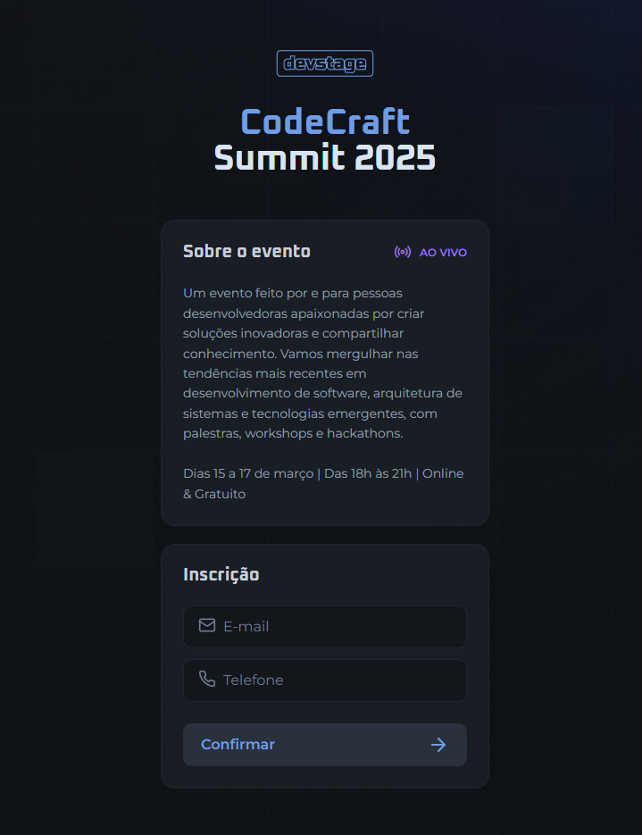
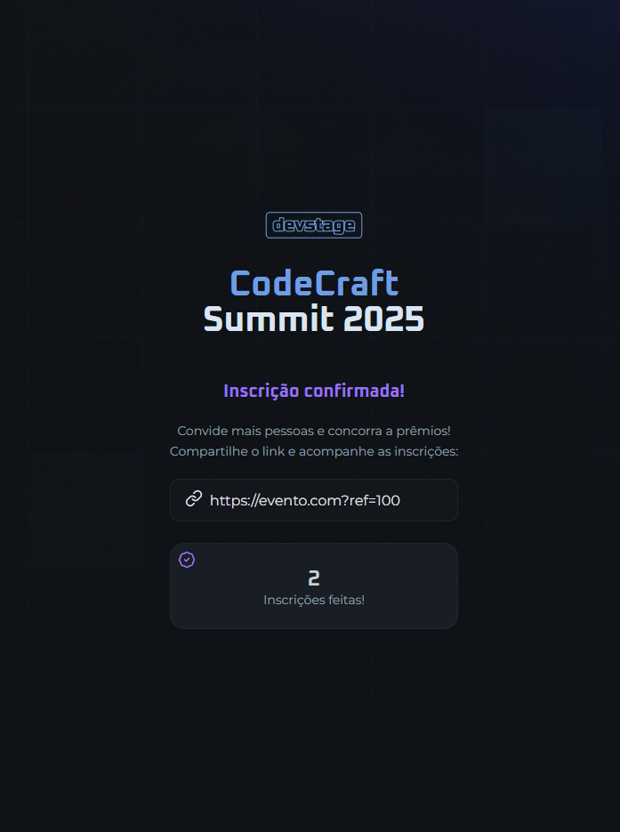

# CodeCraft Summit 2025

## Descrição

O **CodeCraft Summit 2025** é um projeto de sistema de inscrição para eventos, desenvolvido com HTML, CSS e JavaScript puro. O objetivo é permitir que usuários se inscrevam para um evento e compartilhem um link de referência para convidar outras pessoas. O sistema contabiliza quantas inscrições foram realizadas por meio de cada link compartilhado.

## Funcionalidades

- **Inscrição de participantes**: Os usuários podem se cadastrar com e-mail e telefone.
- **Geração de link de convite**: Cada inscrito recebe um link único para compartilhar.
- **Contagem de referência**: O sistema registra e exibe quantas pessoas se inscreveram pelo link compartilhado.
- **Interface intuitiva**: Design simples e responsivo para melhor experiência do usuário.

## Tecnologias Utilizadas

- **HTML5**: Estrutura da aplicação.
- **CSS3**: Estilização da interface.
- **JavaScript (ES6+)**: Lógica do sistema e manipulação do DOM.

## Capturas de Tela

### Página de Inscrição



### Confirmação de Inscrição



## Estrutura do Projeto

```
/
|-- images/          # Imagens utilizadas no projeto
|-- script/
|   |-- script.js    # Lógica da aplicação
|-- style/
|   |-- style.css    # Estilos da página
|-- index.html       # Estrutura principal do site
```

## Melhorias Futuras

- Integração com backend para persistência de dados.
- Geração dinâmica de links com URLs reais.
- Painel administrativo para acompanhar as inscrições.

---
